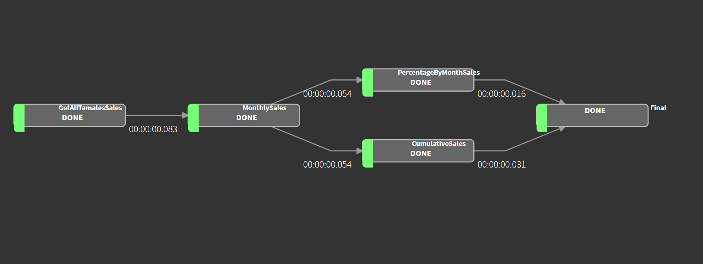

## Simple ETL Luigi 

### Instrucciones de ejecución 

1) crear ambiente virtual y ejecutarlo 
   
   ```
   python -m venv env 
    .\env\Script\activate
    ```
    
2) Instalar dependencias 
    
        pip install -r requirements

3) Ejecutar proceso local 
        
        python main.py 

### Resultados 

Las transformaciones se encuentran en el folder processed 

* cumulative_sales.csv
* monthly_sales.csv
* percentage_month_sales.csv
* total_sales.csv


### Tecnologías

* Python
* Lugi para orquestaciópn 
* Pandas 


### Arquitectura 




La fuente de datos es local. los archivos existen en source 

Se procesan para obtener las ventas mensuales. se muestra el diagrama.


### Ejecución mediante interfaz de Luigi

Es posible ejecutar la interfaz de luigi con el siguiente comando. 

luigid